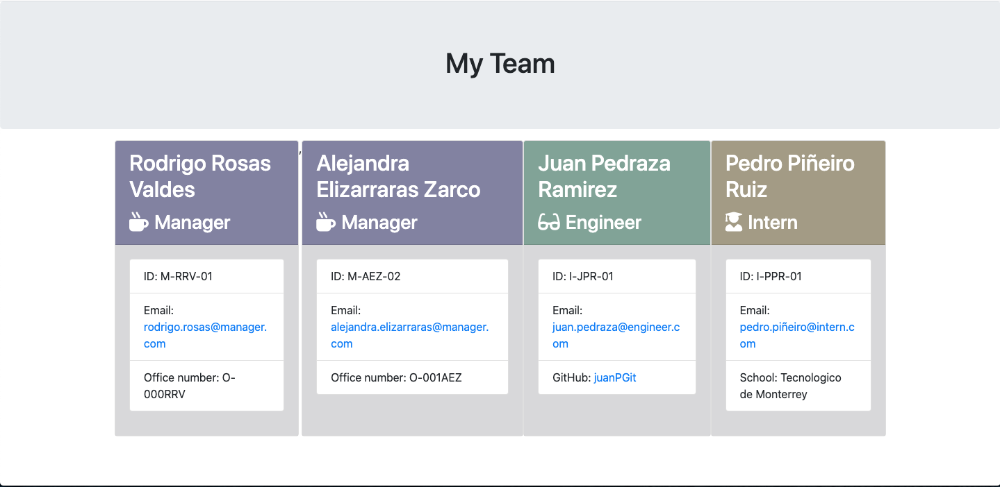

# Employee summary generator 

## Description
The employee summary generator is an app that will allow you to build automatically a summary of your team.
It is a comman line based application.
In terminal add as many employees you want.
Fill all the information requested.
Finally you will get an html with all the information you added.

## Table of contents
* [Installation](#installation)
* [Usage](#usage)
* [Contributing](#contributing)
* [Tests](#tests)
* [Questions](#questions)
* [Github info](#Github)

## Installation
1. Download the proyect.

2. Open a Terminal.

3. Go to the proyects folder.

4. Run npm i to install the dependencies.

5. In the terminal write node app.js to execute the application.

## Usage 
1. In the terminal select if you want to add a new employee.

2. If yes fill the employee information.

3. Add as many employees as you want.

4. Select No when the terminal pops the question if you want to add more employees.

5. The app will generate automatically a new html file in the ./output folder - team.html

6. Open html file in your browser.

## Contributing
This is a code free to share.

## Tests
`
-Employee.test.js
-Engineer.test.js
-Intern.test.js
-Manager.test.js

`

## Questions
-What can I expect from this site?

Build a summary of your team.

## Github
### Picture

### Github Email
<rodrigo.rosasv@gmail.com>

